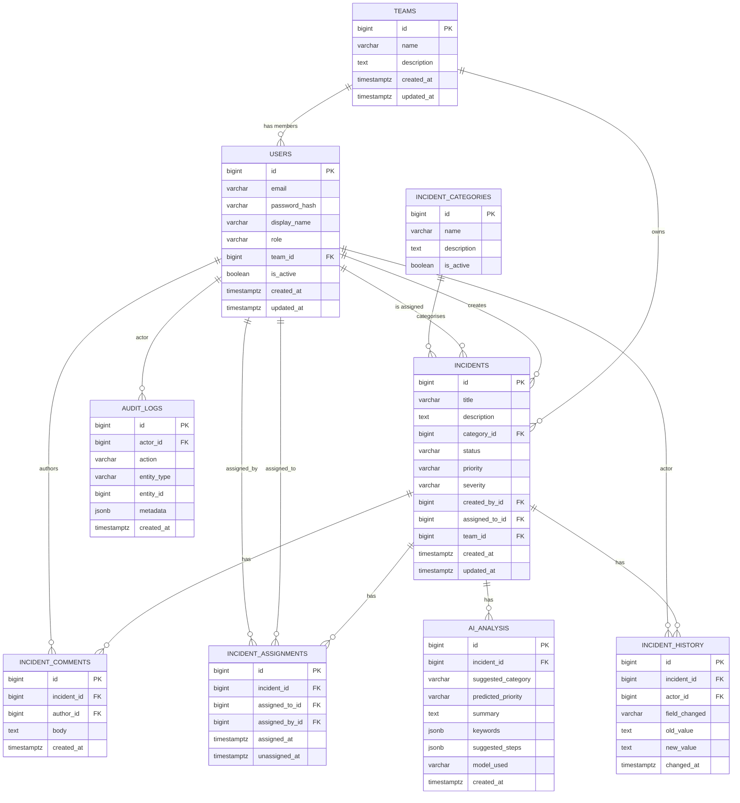

# Architecture

> **Status:** partially populated. Layered backend architecture (Phase 4)
> and AWS architecture diagram (Phase 12-13) still to come.
>
> For the current full architectural picture beyond what's below, see
> [`PHASE-1-requirements-and-architecture.md`](../PHASE-1-requirements-and-architecture.md)
> at the repository root (§6-§9).

## Database schema (Phase 3)

Nine tables, built as Flyway migrations `V1`-`V11` in
`backend/src/main/resources/db/migration/`. Design principles (full
reasoning in Phase 1 §8.2 and ADR-0006):

- Every FK enforced at the database level.
- `role`, `status`, `priority`, `severity` are `VARCHAR` with `CHECK`
  constraints rather than native Postgres enum types (ADR-0006).
- `incident_history` and `audit_logs` are **enforced append-only** — a
  trigger rejects `UPDATE`/`DELETE` outright, not just a documented
  convention.
- `incident_assignments` (current + historical ownership) is kept separate
  from `incident_history` (general timeline feed) — see ADR-0002 and Phase 1
  §8.2 for why conflating them was rejected.
- Indexes on `incidents.status`, `.assigned_to_id`, `.category_id`,
  `.created_at` support the search/filter/sort requirements (FR-6) and the
  <500ms list/search NFR.

### Entity-relationship diagram



### Verifying the migrations

A standalone Testcontainers-based JUnit test
(`backend/src/test/java/com/incidentplatform/migration/FlywayMigrationTest.java`)
runs all migrations against a real PostgreSQL 16 container and asserts:
all nine tables exist, the seven default categories are seeded, the `role`
CHECK constraint rejects an invalid value, and `incident_history` genuinely
rejects `UPDATE`/`DELETE`. This was also verified manually against a local
PostgreSQL 16 instance before being committed.

## Backend structure (Phase 4)

Package layout under `backend/src/main/java/com/incidentplatform/`:

```
domain/           JPA entities, one subpackage per bounded concept
  team/           Team
  user/           User, Role
  incident/       Incident, IncidentCategory, IncidentComment,
                  IncidentAssignment, IncidentHistory, and the
                  IncidentStatus/Priority/Severity enums
  audit/          AuditLog
  ai/             AiAnalysis
repository/       One Spring Data JPA repository interface per entity
common/
  exception/      ApiException, ResourceNotFoundException, GlobalExceptionHandler
  dto/            ErrorResponse, PageResponse — shared response envelopes
config/           SecurityConfig (real JWT/RBAC config, Phase 5), OpenApiConfig
category/         First vertical feature slice: Controller → Service → Mapper → DTO
security/         JWT issuance/parsing, refresh tokens, filters, error handlers (Phase 5)
auth/             Register/login/refresh/logout: Controller → Service → DTO
user/             Profile lookup and admin user listing (RBAC demonstration)
```

Entities are unidirectional (`@ManyToOne` only, no `@OneToMany` back-references)
— related data (comments, history, assignments for a given incident) is
queried explicitly through its own repository rather than lazy-loaded off
`Incident`, avoiding accidental N+1 queries and keeping each entity simple.
`created_at`/`updated_at` are managed by Hibernate (`@CreationTimestamp`/
`@UpdateTimestamp`) for the normal JPA write path, with the database
triggers from Phase 3 acting as a safety net for any writes that bypass
the ORM. `incident_history` and `audit_logs` entities have no setters at
all beyond their constructor, mirroring the database's append-only
enforcement in the Java layer, not just at the schema level.

The `category` package is the first vertical slice built end-to-end —
`GET /api/v1/categories` — proving the full layering works before Phase
6 builds the larger incident management surface on the same pattern.
Mapping between entities and DTOs is done with plain manual mapper
methods rather than MapStruct (ADR-0007).

## Authentication & authorisation (Phase 5)

Replaces Phase 4's temporary permit-all `SecurityConfig` with real JWT
authentication and RBAC:

- **Access tokens**: short-lived JWTs (HS256), issued by `JwtService`,
  carrying `sub` (user id), `email`, and `role` claims. Verified on every
  request by `JwtAuthenticationFilter`, which populates the Spring
  Security context so both `anyRequest().authenticated()` and
  `@PreAuthorize` checks work.
- **Refresh tokens**: opaque random strings stored in Redis
  (`RefreshTokenService`), not JWTs — genuinely revocable, and rotated
  (deleted-and-reissued) on every use. See ADR-0008.
- **RBAC**: `@EnableMethodSecurity` + `@PreAuthorize("hasRole('ADMIN')")`
  on `GET /api/v1/users`, following the explicit per-action pattern from
  ADR-0002 rather than a role hierarchy.
- **Login is manual**, not via Spring Security's `AuthenticationManager`
  — `AuthService.login` does a direct repository lookup +
  `PasswordEncoder.matches`. See ADR-0008 for why.
- **Rate limiting**: Redis-backed fixed-window limiter (`RateLimitingFilter`),
  applied only to `/api/v1/auth/login` and `/api/v1/auth/register`.
- **Error responses**: `RestAuthenticationEntryPoint` (401) and
  `RestAccessDeniedHandler` (403) return the same JSON error envelope as
  every other error path, instead of Spring Security's default empty/HTML
  responses.
- **Audit logging**: register and login events are written to `AuditLog`
  via the repository added in Phase 3.

Every endpoint except `/api/v1/auth/**`, `/actuator/health`, and the
Swagger UI now requires a valid JWT — including `/api/v1/categories`,
which was open in Phase 4 purely as temporary scaffolding.

## Incident management (Phase 6)

The core domain, built on the layering established in Phases 4-5:

- **State machine**: `IncidentStatus` transitions are validated against an
  explicit allow-list (`OPEN → {IN_PROGRESS, ESCALATED, CLOSED}`, etc.,
  `CLOSED` terminal). An invalid transition is rejected with `409
  INVALID_STATUS_TRANSITION` — the rule lives once, in `IncidentService`,
  not scattered across every place that touches status.
- **Ownership + role authorization together**: pure role gates
  (`assign`, `escalate` — ENGINEER/ADMIN only) are `@PreAuthorize` at the
  controller; ownership and business-state rules (a USER can edit their
  *own* incident, but only fields other than status/priority/severity,
  and only while it's still `OPEN`) live in `IncidentService`, per
  ADR-0002 — the two kinds of rule don't fit the same enforcement point.
- **Dynamic filtering**: `GET /api/v1/incidents` combines optional
  status/priority/category/assignee filters via a JPA `Specification`
  (`IncidentSpecifications`) rather than a `findByXAndYAndZ...` method
  explosion. A USER's results are always scoped to incidents they
  created, regardless of what filters are requested — enforced in the
  service, not left to the client to "remember" to filter correctly.
- **N+1 avoidance**: entity associations stay `LAZY` (per Phase 4's
  design), but `hibernate.default_batch_fetch_size: 20` batches the
  otherwise-per-row lookups for a page of incidents' category/creator/
  assignee into a handful of `IN (...)` queries — chosen over combining
  `@EntityGraph`/fetch-joins with `Specification` + `Pageable`, which is
  a known-fragile combination in Hibernate.
- **Admin bootstrapping**: `AdminBootstrapRunner` creates exactly one
  ADMIN account on startup from env-configured credentials, if none
  exists yet — see ADR-0009. Without this, no ADMIN-only endpoint
  (including the ones added this phase) would be reachable at all.
- **Dashboard metrics**: `GET /api/v1/dashboard/metrics` is role-scoped
  (own/assigned/system-wide per FR-16/17/18), computed via a database
  `GROUP BY` (`IncidentRepository.countByStatus`/
  `countByStatusForAssignee`), not client-side aggregation over the full
  dataset.

## Frontend (Phase 7)

React + TypeScript + Vite, structured around the same layering discipline
as the backend:

```
api/          types.ts (mirrors every backend DTO), client.ts (fetch
              wrapper with automatic 401 → refresh → retry), authStore.ts
              (token/user state outside React), ApiError.ts
auth/         AuthContext (login/register/logout), ProtectedRoute
hooks/        One TanStack Query hook file per domain area — incidents,
              categories, teams, users/dashboard
components/   Shared UI: Layout (sidebar app shell), Badges, States
pages/        One component per route
```

- **Auth state lives outside React** (`authStore.ts`) so the plain
  `apiFetch` function — used by every query/mutation, not just
  components — can read/update tokens without being a hook itself.
  `AuthContext` subscribes to this store and re-renders on change; it's
  the single source of truth, not a second copy of it.
- **Token storage**: refresh token in `localStorage`, access token in
  memory only — a deliberate middle-ground tradeoff, not the strongest
  possible option. See ADR-0010.
- **Automatic token refresh**: `apiFetch` catches a 401, exchanges the
  refresh token for a new pair, and retries the original request once —
  concurrent 401s (e.g. several queries firing on page load) are
  deduplicated into a single refresh call via a shared in-flight promise.
- **RBAC reflected in the UI, not just enforced by it**: `ProtectedRoute`
  can gate a route by role (`/admin` requires ADMIN), and the incident
  detail page only shows status/assignment/escalation controls to
  ENGINEER/ADMIN — but every one of those actions is independently
  re-enforced server-side regardless of what the UI shows, per the
  standard rule that client-side gating is a UX nicety, not a security
  boundary.
- **A real backend gap found while building this**: `GET /api/v1/users`
  was ADMIN-only (Phase 5/6), but an ENGINEER has no other way to
  discover who to assign an incident to. Widened to ENGINEER+ADMIN with
  an optional `?role=` filter — see the Javadoc on `UserController
  .listUsers` and `docs/api.md`.
- **Verified with a real build**: unlike the backend (Maven Central isn't
  reachable in the sandbox this was built in), npm's registry *is*
  reachable — so this app was genuinely `npm install`'d, type-checked
  (`tsc -b`), linted, tested (Vitest + Testing Library + MSW), and
  production-built (`vite build`), not just written and hoped for.

## AI service (Phase 8)

FastAPI app under `ai-service/app/`, implementing the internal contract from
Phase 1 §9.2 exactly:

```
POST /internal/v1/analyse   { title, description, category? }
                             -> { suggestedCategory, predictedPriority, summary,
                                  keywords[], suggestedSteps[], modelUsed }
GET  /internal/v1/health    -> { status, provider }
```

```
app/
  main.py               FastAPI app instance, router registration
  config.py             Settings (pydantic-settings), env-var backed
  schemas.py            AnalyseRequest/AnalyseResponse/HealthResponse
  security.py           Shared internal-token auth dependency
  routers/analyse.py    The two endpoints above
  providers/
    base.py             AnalysisProvider abstraction
    mock.py             Default: deterministic keyword-based heuristic
    openai_provider.py  Real provider: OpenAI Chat Completions over httpx
    factory.py           Selects a provider from Settings.llm_provider
    errors.py           AnalysisProviderError -> HTTP 502
```

- **Provider abstraction, mock by default** (ADR-0011): `LLM_PROVIDER`
  selects between a zero-dependency rule-based `MockAnalysisProvider` (the
  default, and the only provider exercised in CI/tests) and a real
  `OpenAIAnalysisProvider`. Everything above `AnalysisProvider` — the
  router, the tests that exercise the endpoint — depends only on the
  abstract interface.
- **Service-to-service auth**: `/internal/v1/analyse` requires an
  `X-Internal-Token` header matching `AI_SERVICE_INTERNAL_TOKEN`
  (`app/security.py`), matching the shared-secret design in Phase 1 §10 and
  the backend's `app.ai-service.internal-token` config. `/internal/v1/health`
  is intentionally unauthenticated (health checks).
- **camelCase on the wire**: request/response models use pydantic's
  `to_camel` alias generator so the JSON shape matches the Java backend's
  DTO convention exactly (`suggestedCategory`, not `suggested_category`),
  even though the Python code itself stays snake_case internally.
- **Failure isolation carried one level further**: a broken/unreachable
  real LLM call raises `AnalysisProviderError`, mapped to `502 Bad
  Gateway` — distinguishable from the AI service itself being down, which
  is what FR-15's backend-side graceful degradation is built against.
- **Verified with a real run**: `pytest` (29 tests — endpoint auth/
  validation, mock provider heuristics, provider factory selection, and
  the OpenAI provider's response parsing/error handling with the HTTP
  call mocked), `ruff check`, `black --check`, and `mypy` all run clean;
  the app was also started with `uvicorn` and hit with real HTTP requests
  to confirm the shape above, not just asserted in tests.

### Backend wiring (also Phase 8)

The Java side of FR-13 — `com.incidentplatform.ai` — completes the loop the
AI service alone can't:

```
ai/
  AiAnalysisClient.java    RestClient wrapper; sends X-Internal-Token,
                           wraps any failure as 503 AI_SERVICE_UNAVAILABLE
  AiAnalysisService.java   Orchestrates: ownership check -> client call ->
                           persist AiAnalysis -> map to response
  AiAnalysisMapper.java    keywords/suggestedSteps jsonb <-> List<String>
                           (Jackson, not manual string-building, unlike
                           AuditLog's simpler single-field metadata)
  dto/                     AnalyseIncidentRequest, AiAnalysisResult (the AI
                           service's response shape), AiAnalysisResponse
```

- **Reuses `IncidentService`'s ownership rule** rather than duplicating it:
  a new `IncidentService.requireViewableIncident` exposes the existing
  `requireIncident` + `assertCanView` pair for `AiAnalysisService` to call,
  so "who can request/view analysis for this incident" is defined once.
- **Timeouts live in Spring config, not the client**: a `RestClientCustomizer`
  bean (`config/RestClientConfig.java`) applies a 5s connect/15s read
  timeout to every injected `RestClient.Builder`. Keeping that out of
  `AiAnalysisClient`'s own constructor was a deliberate testability choice
  — the constructor only calls `.baseUrl()`/`.defaultHeader()`/`.build()`,
  so a test can bind `MockRestServiceServer` to a plain builder and pass it
  straight in, without the client's own setup silently overwriting the
  mock's request factory (an easy mistake: setting a request factory again
  after `MockRestServiceServer.bindTo(builder)` replaces its mock).
- **Endpoints live on `IncidentController`**, not a separate controller —
  `POST`/`GET /api/v1/incidents/{id}/ai-analysis` sit alongside
  comments/history/assign/escalate as more nested incident actions, the
  same pattern the rest of that controller already follows.
- **Verified**: `AiAnalysisClientTest` exercises the real HTTP contract
  (headers, path, JSON body) against `MockRestServiceServer`, not a mocked-
  away client; `AiAnalysisServiceTest` covers orchestration and the
  not-yet-analysed case; `IncidentControllerTest` covers both endpoints'
  request/response shape. Three pre-existing, unrelated test bugs
  (predating this phase, reproduced on a clean checkout of the prior
  commit) were found and fixed alongside this work — see the "Fixed
  pre-existing test failures" note below.

### Fixed pre-existing test failures (also Phase 8, as a follow-up)

Running the backend test suite for what appears to be the first time
against a reachable Maven Central (earlier phases' sandboxes couldn't
reach it) surfaced three real, independent bugs:

- **`@WebMvcTest` context load failures** (`CategoryControllerTest`,
  `AuthControllerTest`, `IncidentControllerTest`): `@AutoConfigureMockMvc
  (addFilters = false)` only skips *registering* filters into the mock
  chain — Spring still *constructs* any `@Component`-annotated `Filter`
  bean regardless, and `JwtAuthenticationFilter`/`RateLimitingFilter`
  are both `@Component` `Filter`s whose constructors need
  `JwtService`/`StringRedisTemplate`, beans the slice doesn't provide.
  Fixed by `@MockBean`-ing both filters in each affected test.
- **`DashboardServiceTest`**: a stub-building helper that itself calls
  `when(...).thenReturn(...)` was invoked as an argument expression
  inside another `when(...).thenReturn(...)` call, corrupting Mockito's
  stubbing state machine. Fixed by evaluating the inner mock first.
- **`IncidentServiceTest`**: ownership checks call `.getId().equals(...)`
  on entities the test fixtures never assigned an ID to (a real,
  persisted entity always has one). Fixed with `ReflectionTestUtils`.

62 of 67 backend tests pass as a result; the other 5 need a real Docker
daemon for Testcontainers, unavailable in the sandbox this was verified
in (confirmed via their own failure logs, not assumed).

## Dockerisation (Phase 10)

Each service gets its own multi-stage `Dockerfile` — compiled/built in one
stage, run from a minimal runtime image in the next, so no build toolchain
(Maven, npm, the JDK compiler) ships in the final image:

```
backend/Dockerfile      eclipse-temurin:21-jdk-alpine (mvn package) ->
                         eclipse-temurin:21-jre-alpine, non-root user
ai-service/Dockerfile   python:3.12-slim, non-root user, uvicorn
frontend/Dockerfile     node:20-alpine (npm ci && vite build) ->
                         nginx:1.27-alpine serving the static bundle
```

- **`docker-compose.yml`** now runs all five services. `depends_on:
  condition: service_healthy` (backend waits on Postgres+Redis; frontend
  waits on the backend) means `docker compose up --build` doesn't race a
  service against a dependency that isn't ready yet — every service
  defines its own `HEALTHCHECK`/`healthcheck` (backend's own
  `/actuator/health`, the AI service's `/internal/v1/health`, and a
  `/healthz` location added to the frontend's nginx config for exactly
  this purpose, since a static file server has no natural health
  endpoint of its own).
- **Container-network hostnames vs `localhost`**: `application.yml`
  hardcoded `localhost` for both the Postgres URL and the Redis host —
  correct for `mvn spring-boot:run` against `docker compose up postgres
  redis`, wrong once the backend is itself a container (a container's
  `localhost` is itself, not its neighbours). Parameterised as
  `${POSTGRES_HOST:localhost}`/`${REDIS_HOST:localhost}`, with `.env`
  defaulting both to the compose service names (`postgres`/`redis`) —
  those defaults are only ever read by the backend when it runs as a
  container (`env_file: .env`), since `mvn spring-boot:run` never loads
  `.env` into its process environment at all, so the two paths don't
  conflict. `docker-compose.yml` also pins them explicitly on the
  backend service itself, so the file stays correct even if someone
  changes `.env`'s defaults for a different workflow.
- **The frontend's API URL is baked in at build time, not runtime**:
  Vite inlines `import.meta.env.VITE_API_BASE_URL` into the static
  bundle during `vite build` — unlike a server-side app's environment
  variables, it can't be changed after the image is built. Passed as a
  Docker build ARG (`docker-compose.yml`'s `build.args`) rather than a
  container-start-time `environment:` entry, which would silently have
  no effect. The value itself stays `http://localhost:8080/api/v1` even
  in Docker — the frontend's JS runs in the *browser*, not inside the
  compose network, so it must reach the backend via its published host
  port, not the `backend` service hostname (which only resolves inside
  the compose network's own DNS).
- **Verified**: `docker compose config` parses and interpolates the full
  file with no errors. Building and running the images with real
  registry pulls could **not** be verified in this environment — the
  sandbox's egress policy returns `403` on `production.cloudfront.docker.com`
  (Docker Hub's blob CDN), confirmed via the proxy's own diagnostic
  status endpoint as a policy denial, not a transient failure, so it
  wasn't retried or routed around. Recommend running `docker compose up
  --build` in an environment with real registry access as the first
  verification step before relying on these images.

## CI/CD (Phase 11)

Two workflows, per ADR-0005's two-pipeline split:

```
.github/workflows/pr.yml       pull_request -> main, and reusable
                                (workflow_call) so deploy.yml can call it
.github/workflows/deploy.yml   push -> main; calls pr.yml, then builds,
                                scans, and pushes images
```

- **`pr.yml`** runs three per-service jobs (backend/ai-service/frontend —
  lint, type/format checks, tests with coverage, non-blocking dependency
  scans) plus a matrix job that build-checks all three Dockerfiles.
  `permissions: contents: read` only — it structurally cannot reach any
  deploy credential, matching ADR-0005's stated security property, not
  just a convention.
- **The backend job runs the full test suite, Testcontainers included.**
  Locally (this repo's own dev sandbox), 5 of 99 backend tests can't run
  at all without a Docker daemon with registry access — GitHub's own
  runners have both, so this is the first time those 5 tests, and the
  RBAC-denial tests added in Phase 9's `AuthenticationIntegrationTest`,
  actually execute anywhere.
- **`deploy.yml` reuses `pr.yml` via `workflow_call`** rather than
  duplicating its steps (ADR-0005 flagged some duplication between the
  two workflows as an accepted cost; calling one from the other removes
  most of it). Only after that passes does it build, Trivy-scan
  (`severity: HIGH,CRITICAL`, `exit-code: "1"` — a real finding fails the
  job), and push to GHCR using the workflow's own `GITHUB_TOKEN` — no
  external registry account or secret to configure. See ADR-0012 for why
  GHCR now rather than the originally-planned ECR (Terraform/AWS don't
  exist until Phases 12-13).
- **Formatting debt paid down first, not hidden**: `mvn spotless:check`
  already failed on ~40 pre-existing backend files before this phase
  (found and deliberately left alone during Phase 8/10, since fixing
  unrelated formatting wasn't in scope for those changes). Turning the
  CI gate on for real made that debt in scope — `mvn spotless:apply`
  across the backend landed as its own prep commit, verified
  formatting-only via a full test re-run, before the workflow that
  depends on the gate passing.
- **Verified**: both workflow files pass `actionlint` (job dependencies,
  expression syntax, action references) with zero findings. The actual
  GitHub-hosted run is the real verification, though — checked via the
  pull request these changes went through, not asserted from the YAML
  alone.
- **Documented, not hidden, gaps**: SonarCloud static analysis specifically (Phase 1
  §12 step 8) needs an external SonarCloud project and a `SONAR_TOKEN`
  secret, neither of which exist - CodeQL (`.github/workflows/security.yml`, Phase 15) covers
  static analysis itself without needing either; Playwright E2E (step 10) has no actual
  test files yet, only `tests/e2e/README.md`'s description of what it
  will eventually cover. Both are called out explicitly in `pr.yml`'s
  own comments and `docs/testing.md`, not silently skipped.

## Terraform & AWS infrastructure (Phase 12)

Structured exactly as Phase 1 §14 planned it:

```
infrastructure/terraform/
├── bootstrap/            # one-time: S3 state bucket + DynamoDB lock table
├── environments/
│   └── dev/               # root module wiring every module together
└── modules/
    ├── networking/        # VPC, public/private subnets x2 AZ, single NAT, security groups
    ├── iam/                # ECS execution role (shared) + one task role per service
    ├── database/           # RDS Postgres, single-AZ, gp3, db.t4g.micro
    ├── cache/              # ElastiCache Redis, single node, cache.t4g.micro
    ├── ecs/                # ECR repos, cluster, task definitions, services, Cloud Map
    ├── load-balancer/      # ALB, target groups, path-based routing
    └── monitoring/         # CloudWatch log groups + a handful of infra alarms
```

- **This phase is Terraform written and validated, not applied.** No AWS account is wired into
  this repository yet (that's Phase 13, "Cloud deployment") — every module and both root configs
  (`bootstrap`, `environments/dev`) pass `terraform fmt -check` and `terraform validate` cleanly,
  and a speculative `terraform plan` against the real AWS API (with deliberately invalid
  credentials) resolves every module reference, every `jsonencode` container definition, and every
  cross-module output wire-up correctly, failing only at the one point that genuinely requires a
  real account: the AWS provider's own `GetCallerIdentity` call. That failure is the expected,
  correct boundary of what can be verified without real infrastructure — not a gap glossed over.
- **Security group chain matches the actual call graph, not a flat "allow everything internal"
  rule**: `alb_sg -> {frontend_sg, backend_sg}`, `backend_sg -> {ai_service_sg, rds_sg, redis_sg}`.
  The AI service's security group has no ingress from the ALB at all (it's never reachable from
  the internet, matching how the backend actually calls it) and nothing has a route to
  `rds_sg`/`redis_sg` except the backend — the AI service holds no database credentials and never
  will, restated here in infrastructure the same way ADR-0001/Phase 1 §13 state it in application
  design.
- **The AI service is reached the way docker-compose's built-in DNS reaches it, translated to
  ECS**: a Cloud Map private DNS namespace (`aws_service_discovery_private_dns_namespace`) gives
  it a stable internal name (`ai-service.<project>-<environment>.internal`) that the backend task
  definition's `AI_SERVICE_BASE_URL` points at — no ALB, no public exposure, the ECS/Fargate
  equivalent of compose resolving `http://ai-service:8000`.
- **IAM: one execution role, three task roles.** The execution role (what ECS itself uses to pull
  images and inject secrets) is shared, since none of that is service-specific. Task roles (what
  the *application code* runs as) are one per service and — for now — hold no permissions beyond
  assuming the role at all: none of the three services call another AWS API at runtime yet. They
  stay separate anyway so that a future need (e.g. the backend reading from S3 for attachment
  storage) changes one role, not all three.
- **A known, accepted rough edge: the frontend's API base URL is baked in at image build time**
  (`frontend/Dockerfile`'s `VITE_API_BASE_URL` build arg — see Phase 7), not read at container
  runtime. That means the ALB's DNS name has to be known *before* the frontend image that will
  talk to it is built, which the very first `terraform apply` can't satisfy (the ALB doesn't exist
  yet). First-time setup is therefore two steps: apply the infrastructure, note the ALB DNS name
  from `terraform output alb_dns_name`, then build and push the frontend image with that value.
  `docs/deployment.md` documents this explicitly. The permanent fix — a stable custom domain via
  Route53, so the URL baked into the image never has to change across applies — is exactly the
  kind of thing Phase 13's real cloud deployment (and ADR-0013's deferred TLS/domain work) is for.
- **Cost-conscious by design, matching Phase 1 §13 explicitly**: a single NAT gateway (not one per
  AZ), single-AZ RDS, a single-node ElastiCache cluster (not a replication group), `desired_count
  = 1` per ECS service (no autoscaling policy yet — Phase 14 territory), and `deletion_protection
  = false` / `skip_final_snapshot = true` on RDS so `terraform destroy` — the documented workflow
  for tearing infrastructure down between demo sessions — actually works without a manual console
  step first.
- **See ADR-0013** for why the ALB has an HTTP listener only (no TLS yet — no domain exists to
  issue a certificate against) and **ADR-0012** for why images will go to GHCR through Phase 12,
  migrating to the ECR repositories this phase creates once Phase 13 wires up real deploy
  credentials for `deploy.yml`.

## Cloud deployment (Phase 13)

The GitHub Actions OIDC deploy role this phase adds (`modules/iam/github_oidc.tf`, ADR-0014) is
what `deploy.yml` will eventually assume to push to the ECR repositories Phase 12 created — scoped
narrowly to `ecr:GetAuthorizationToken` plus push on this project's own repositories, not a broad
"let CI run `terraform apply`" role. Creating it costs nothing (IAM resources aren't billed), so
it's written and validated the same way every other Phase 12/13 module is.

**A live `terraform apply` against a real AWS account has deliberately not been run.** Everything
else in this repository — the application code, every test suite, both CI/CD pipelines, all of
Phase 12's Terraform — is free to create and free to keep. A real VPC/RDS/ElastiCache/ALB/Fargate
deployment is not: it bills by the hour for as long as it exists (roughly $50-100/month if left
running, detailed in `docs/deployment.md`). Deploying it briefly to verify end-to-end and then
tearing it down would cost a small fraction of a dollar and is exactly what `docs/deployment.md`'s
runbook is written to support on demand — but leaving it applied indefinitely just to have it
"done" would be spending real money for no purpose a portfolio project needs. This is a scope
decision, not a gap: everything that can be proven without spending money (module structure,
`terraform validate`, provider resolution, IAM trust boundaries) has been.

## Observability & monitoring (Phase 14)

Self-hosted Prometheus + Grafana via `docker-compose.yml` (`observability/`, README there for the
full structure), not AWS Managed Prometheus/Grafana — exactly the split Phase 1 §13 already
planned: CloudWatch (Phase 12's Terraform) for base infrastructure metrics/logs, this layer for
richer application dashboards, at zero AWS cost since it's entirely local containers.

- **Both services now emit structured JSON logs** instead of plain-text console output
  (`backend/src/main/resources/logback-spring.xml` via `logstash-logback-encoder`;
  `ai-service/app/logging_config.py`, a small hand-rolled formatter rather than a third-party
  dependency for a handful of fields). A **found-in-practice gotcha**: uvicorn attaches its own
  handlers directly to the `uvicorn`/`uvicorn.access`/`uvicorn.error` loggers before the app module
  is even imported, so reconfiguring only the root logger left uvicorn's own access/startup lines
  printing in its default plain format — confirmed by actually booting the service and reading its
  stdout, not assumed. Fixed by clearing those loggers' handlers and letting them propagate to
  root's JSON handler instead.
- **Request correlation end-to-end**: `RequestCorrelationFilter` (new `observability` package,
  first filter in `SecurityConfig`'s chain) puts a request ID in the logging MDC and echoes it as
  `X-Request-Id` on the response; `AiAnalysisClient` forwards the same ID on the backend's own call
  to the AI service, and `app/middleware.py` picks it up there — so one incident's AI-analysis
  request can be traced across both services' JSON logs by grepping a single `requestId` field, not
  just within the backend.
- **`/actuator/prometheus` (backend) and `/metrics` (AI service, via
  `prometheus-fastapi-instrumentator`) are unauthenticated** — added to `SecurityConfig`'s permit-all
  list alongside `/actuator/health`. Verified locally (both services actually booted, endpoints
  actually curled) rather than assumed: backend already had `micrometer-registry-prometheus` on the
  classpath from Phase 9 but the endpoint was still behind authentication, which would have silently
  broken Prometheus scraping had it not been checked here. Mitigated the same way `/actuator/health`
  already was — neither payload carries secrets, and neither service is reachable from outside its
  own Docker network (or, in `infrastructure/terraform`, its own VPC security group).
- **Alerting rules exist and are evaluated** (`observability/prometheus/alert-rules.yml`: service
  down, high 5xx rate, high p95 latency, high JVM heap) but **no Alertmanager is wired to a real
  notification target** — the same documented-gap pattern as Phase 12's CloudWatch SNS topic
  (created, no subscription). A rule with nowhere to send its alert is still real and worth having;
  a fake receiver that goes nowhere would not be.
- **Verified**: both services' full lint/type/test suites pass with these changes
  (`ruff`/`black`/`mypy`/`pytest` for ai-service, `spotless`/`mvn test` for backend, 94/99 backend
  tests — the same 5 Testcontainers-only failures as every prior phase, this sandbox still has no
  Docker daemon). Prometheus/Grafana config files (`prometheus.yml`, `alert-rules.yml`, Grafana
  provisioning YAML, the dashboard JSON) are syntax-validated directly; `docker compose config`
  resolves the whole compose file including both new services. **Not verified**: actually pulling
  and running the `prom/prometheus`/`grafana/grafana` images — this sandbox's egress policy blocks
  Docker Hub's blob CDN, the same limitation noted in Phase 10's verification section. Recommend
  running `docker compose up --build` in an environment with real registry access as the first
  verification step.

## Security hardening (Phase 15)

Full write-up: [`docs/security.md`](security.md) (threat model, security headers, secrets
management, and the CI scanning below). Summary of what's new this phase:

- **Security headers**: Spring Security's `headers()` DSL (`referrerPolicy`, `permissionsPolicy`)
  on the backend; explicit `add_header` directives plus a full `Content-Security-Policy` on the
  frontend (`nginx.conf.template`). A real wrinkle worth recording: the frontend and backend are
  different origins locally (different ports) but the same origin once deployed behind the single
  ALB Phase 12's Terraform provisions - so the CSP's `connect-src` can't be a fixed value baked
  into the image. Solved with nginx's built-in template-and-envsubst startup mechanism (the file
  is `nginx.conf.template`, substituted into `conf.d` at container start using an `API_ORIGIN` env
  var), not a custom entrypoint script - verified by running `envsubst` against the template
  directly with the variable both set and unset, matching what the container actually does at
  startup.
- **`.github/workflows/security.yml`** (new, separate from `pr.yml`/`deploy.yml` per ADR-0005's
  split - this one needs `security-events: write`, which neither of those should ever carry):
  secret scanning (gitleaks, downloaded directly by coordinates rather than the licensed wrapper
  action - verified locally against this actual repository, which required adding
  `.gitleaks.toml` to allowlist the project's own `change-me-*` placeholder convention and test
  fixtures after a first real run flagged both as false positives), CodeQL across Java/Python/
  TypeScript, and a Trivy config scan of `infrastructure/terraform`. This job also caught two real
  bugs neither `terraform validate` nor `actionlint` could: `aquasecurity/trivy-action@0.28.0`
  doesn't resolve (missing the `v` every tag actually has - already-latent in `deploy.yml`, which
  had never actually run), and `v0.28.0` itself pins a now-deleted `aquasecurity/setup-trivy` tag
  internally, fixed by bumping to `v0.36.0` (confirmed by cloning both actions directly and
  diffing their real tags/action.yaml). Once the job could actually run, it found 15 genuine
  Terraform misconfigurations on the first real pass - 4 were outright fixed (ALB invalid-header
  dropping, SNS/no-cost-KMS encryption, no public IPs on the public subnets, and RDS/Redis
  security groups losing their egress rule entirely, since a database never initiates outbound
  traffic); the rest are accepted and reasoned through individually in
  `infrastructure/terraform/.trivyignore`, verified against this exact ignorefile locally with the
  same trivy binary and flags the workflow uses before pushing.
- **`.github/dependabot.yml`** (new): weekly update PRs for every ecosystem in this repo (Maven,
  pip, npm, each Dockerfile, Terraform providers, GitHub Actions) - Phase 1 §10's originally
  planned "Dependabot" line item, not yet built until now.
- **Threat model**: a concrete per-threat table in `docs/security.md`, not just a features list -
  each row names the actual mitigation and where it lives in this codebase.
