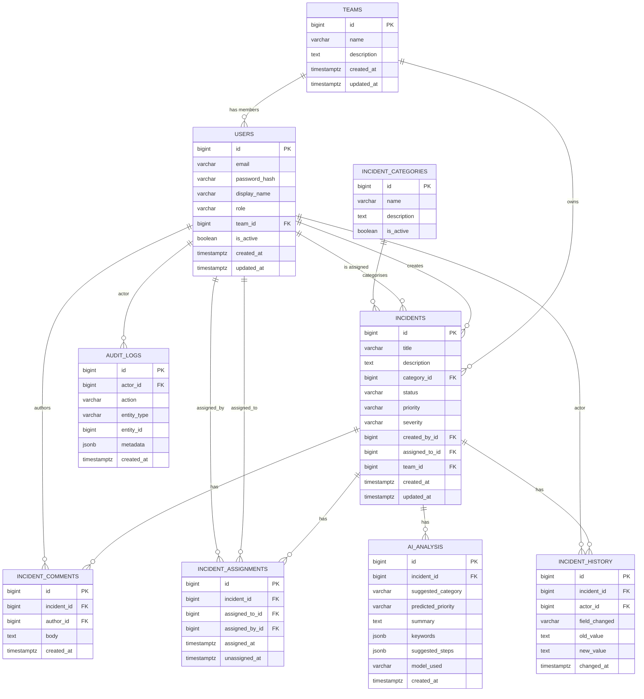

# Architecture

> **Status:** partially populated. Layered backend architecture (Phase 4)
> and AWS architecture diagram (Phase 12-13) still to come.
>
> For the current full architectural picture beyond what's below, see
> [`PHASE-1-requirements-and-architecture.md`](../PHASE-1-requirements-and-architecture.md)
> at the repository root (§6-§9).

## Database schema (Phase 3)

Nine tables, built as Flyway migrations `V1`-`V11` in
`backend/src/main/resources/db/migration/`. Design principles (full
reasoning in Phase 1 §8.2 and ADR-0006):

- Every FK enforced at the database level.
- `role`, `status`, `priority`, `severity` are `VARCHAR` with `CHECK`
  constraints rather than native Postgres enum types (ADR-0006).
- `incident_history` and `audit_logs` are **enforced append-only** — a
  trigger rejects `UPDATE`/`DELETE` outright, not just a documented
  convention.
- `incident_assignments` (current + historical ownership) is kept separate
  from `incident_history` (general timeline feed) — see ADR-0002 and Phase 1
  §8.2 for why conflating them was rejected.
- Indexes on `incidents.status`, `.assigned_to_id`, `.category_id`,
  `.created_at` support the search/filter/sort requirements (FR-6) and the
  <500ms list/search NFR.

### Entity-relationship diagram



### Verifying the migrations

A standalone Testcontainers-based JUnit test
(`backend/src/test/java/com/incidentplatform/migration/FlywayMigrationTest.java`)
runs all migrations against a real PostgreSQL 16 container and asserts:
all nine tables exist, the seven default categories are seeded, the `role`
CHECK constraint rejects an invalid value, and `incident_history` genuinely
rejects `UPDATE`/`DELETE`. This was also verified manually against a local
PostgreSQL 16 instance before being committed.

## Backend structure (Phase 4)

Package layout under `backend/src/main/java/com/incidentplatform/`:

```
domain/           JPA entities, one subpackage per bounded concept
  team/           Team
  user/           User, Role
  incident/       Incident, IncidentCategory, IncidentComment,
                  IncidentAssignment, IncidentHistory, and the
                  IncidentStatus/Priority/Severity enums
  audit/          AuditLog
  ai/             AiAnalysis
repository/       One Spring Data JPA repository interface per entity
common/
  exception/      ApiException, ResourceNotFoundException, GlobalExceptionHandler
  dto/            ErrorResponse, PageResponse — shared response envelopes
config/           SecurityConfig (real JWT/RBAC config, Phase 5), OpenApiConfig
category/         First vertical feature slice: Controller → Service → Mapper → DTO
security/         JWT issuance/parsing, refresh tokens, filters, error handlers (Phase 5)
auth/             Register/login/refresh/logout: Controller → Service → DTO
user/             Profile lookup and admin user listing (RBAC demonstration)
```

Entities are unidirectional (`@ManyToOne` only, no `@OneToMany` back-references)
— related data (comments, history, assignments for a given incident) is
queried explicitly through its own repository rather than lazy-loaded off
`Incident`, avoiding accidental N+1 queries and keeping each entity simple.
`created_at`/`updated_at` are managed by Hibernate (`@CreationTimestamp`/
`@UpdateTimestamp`) for the normal JPA write path, with the database
triggers from Phase 3 acting as a safety net for any writes that bypass
the ORM. `incident_history` and `audit_logs` entities have no setters at
all beyond their constructor, mirroring the database's append-only
enforcement in the Java layer, not just at the schema level.

The `category` package is the first vertical slice built end-to-end —
`GET /api/v1/categories` — proving the full layering works before Phase
6 builds the larger incident management surface on the same pattern.
Mapping between entities and DTOs is done with plain manual mapper
methods rather than MapStruct (ADR-0007).

## Authentication & authorisation (Phase 5)

Replaces Phase 4's temporary permit-all `SecurityConfig` with real JWT
authentication and RBAC:

- **Access tokens**: short-lived JWTs (HS256), issued by `JwtService`,
  carrying `sub` (user id), `email`, and `role` claims. Verified on every
  request by `JwtAuthenticationFilter`, which populates the Spring
  Security context so both `anyRequest().authenticated()` and
  `@PreAuthorize` checks work.
- **Refresh tokens**: opaque random strings stored in Redis
  (`RefreshTokenService`), not JWTs — genuinely revocable, and rotated
  (deleted-and-reissued) on every use. See ADR-0008.
- **RBAC**: `@EnableMethodSecurity` + `@PreAuthorize("hasRole('ADMIN')")`
  on `GET /api/v1/users`, following the explicit per-action pattern from
  ADR-0002 rather than a role hierarchy.
- **Login is manual**, not via Spring Security's `AuthenticationManager`
  — `AuthService.login` does a direct repository lookup +
  `PasswordEncoder.matches`. See ADR-0008 for why.
- **Rate limiting**: Redis-backed fixed-window limiter (`RateLimitingFilter`),
  applied only to `/api/v1/auth/login` and `/api/v1/auth/register`.
- **Error responses**: `RestAuthenticationEntryPoint` (401) and
  `RestAccessDeniedHandler` (403) return the same JSON error envelope as
  every other error path, instead of Spring Security's default empty/HTML
  responses.
- **Audit logging**: register and login events are written to `AuditLog`
  via the repository added in Phase 3.

Every endpoint except `/api/v1/auth/**`, `/actuator/health`, and the
Swagger UI now requires a valid JWT — including `/api/v1/categories`,
which was open in Phase 4 purely as temporary scaffolding.

## Incident management (Phase 6)

The core domain, built on the layering established in Phases 4-5:

- **State machine**: `IncidentStatus` transitions are validated against an
  explicit allow-list (`OPEN → {IN_PROGRESS, ESCALATED, CLOSED}`, etc.,
  `CLOSED` terminal). An invalid transition is rejected with `409
  INVALID_STATUS_TRANSITION` — the rule lives once, in `IncidentService`,
  not scattered across every place that touches status.
- **Ownership + role authorization together**: pure role gates
  (`assign`, `escalate` — ENGINEER/ADMIN only) are `@PreAuthorize` at the
  controller; ownership and business-state rules (a USER can edit their
  *own* incident, but only fields other than status/priority/severity,
  and only while it's still `OPEN`) live in `IncidentService`, per
  ADR-0002 — the two kinds of rule don't fit the same enforcement point.
- **Dynamic filtering**: `GET /api/v1/incidents` combines optional
  status/priority/category/assignee filters via a JPA `Specification`
  (`IncidentSpecifications`) rather than a `findByXAndYAndZ...` method
  explosion. A USER's results are always scoped to incidents they
  created, regardless of what filters are requested — enforced in the
  service, not left to the client to "remember" to filter correctly.
- **N+1 avoidance**: entity associations stay `LAZY` (per Phase 4's
  design), but `hibernate.default_batch_fetch_size: 20` batches the
  otherwise-per-row lookups for a page of incidents' category/creator/
  assignee into a handful of `IN (...)` queries — chosen over combining
  `@EntityGraph`/fetch-joins with `Specification` + `Pageable`, which is
  a known-fragile combination in Hibernate.
- **Admin bootstrapping**: `AdminBootstrapRunner` creates exactly one
  ADMIN account on startup from env-configured credentials, if none
  exists yet — see ADR-0009. Without this, no ADMIN-only endpoint
  (including the ones added this phase) would be reachable at all.
- **Dashboard metrics**: `GET /api/v1/dashboard/metrics` is role-scoped
  (own/assigned/system-wide per FR-16/17/18), computed via a database
  `GROUP BY` (`IncidentRepository.countByStatus`/
  `countByStatusForAssignee`), not client-side aggregation over the full
  dataset.

## Frontend (Phase 7)

React + TypeScript + Vite, structured around the same layering discipline
as the backend:

```
api/          types.ts (mirrors every backend DTO), client.ts (fetch
              wrapper with automatic 401 → refresh → retry), authStore.ts
              (token/user state outside React), ApiError.ts
auth/         AuthContext (login/register/logout), ProtectedRoute
hooks/        One TanStack Query hook file per domain area — incidents,
              categories, teams, users/dashboard
components/   Shared UI: Layout (sidebar app shell), Badges, States
pages/        One component per route
```

- **Auth state lives outside React** (`authStore.ts`) so the plain
  `apiFetch` function — used by every query/mutation, not just
  components — can read/update tokens without being a hook itself.
  `AuthContext` subscribes to this store and re-renders on change; it's
  the single source of truth, not a second copy of it.
- **Token storage**: refresh token in `localStorage`, access token in
  memory only — a deliberate middle-ground tradeoff, not the strongest
  possible option. See ADR-0010.
- **Automatic token refresh**: `apiFetch` catches a 401, exchanges the
  refresh token for a new pair, and retries the original request once —
  concurrent 401s (e.g. several queries firing on page load) are
  deduplicated into a single refresh call via a shared in-flight promise.
- **RBAC reflected in the UI, not just enforced by it**: `ProtectedRoute`
  can gate a route by role (`/admin` requires ADMIN), and the incident
  detail page only shows status/assignment/escalation controls to
  ENGINEER/ADMIN — but every one of those actions is independently
  re-enforced server-side regardless of what the UI shows, per the
  standard rule that client-side gating is a UX nicety, not a security
  boundary.
- **A real backend gap found while building this**: `GET /api/v1/users`
  was ADMIN-only (Phase 5/6), but an ENGINEER has no other way to
  discover who to assign an incident to. Widened to ENGINEER+ADMIN with
  an optional `?role=` filter — see the Javadoc on `UserController
  .listUsers` and `docs/api.md`.
- **Verified with a real build**: unlike the backend (Maven Central isn't
  reachable in the sandbox this was built in), npm's registry *is*
  reachable — so this app was genuinely `npm install`'d, type-checked
  (`tsc -b`), linted, tested (Vitest + Testing Library + MSW), and
  production-built (`vite build`), not just written and hoped for.

## AI service (Phase 8)

FastAPI app under `ai-service/app/`, implementing the internal contract from
Phase 1 §9.2 exactly:

```
POST /internal/v1/analyse   { title, description, category? }
                             -> { suggestedCategory, predictedPriority, summary,
                                  keywords[], suggestedSteps[], modelUsed }
GET  /internal/v1/health    -> { status, provider }
```

```
app/
  main.py               FastAPI app instance, router registration
  config.py             Settings (pydantic-settings), env-var backed
  schemas.py            AnalyseRequest/AnalyseResponse/HealthResponse
  security.py           Shared internal-token auth dependency
  routers/analyse.py    The two endpoints above
  providers/
    base.py             AnalysisProvider abstraction
    mock.py             Default: deterministic keyword-based heuristic
    openai_provider.py  Real provider: OpenAI Chat Completions over httpx
    factory.py           Selects a provider from Settings.llm_provider
    errors.py           AnalysisProviderError -> HTTP 502
```

- **Provider abstraction, mock by default** (ADR-0011): `LLM_PROVIDER`
  selects between a zero-dependency rule-based `MockAnalysisProvider` (the
  default, and the only provider exercised in CI/tests) and a real
  `OpenAIAnalysisProvider`. Everything above `AnalysisProvider` — the
  router, the tests that exercise the endpoint — depends only on the
  abstract interface.
- **Service-to-service auth**: `/internal/v1/analyse` requires an
  `X-Internal-Token` header matching `AI_SERVICE_INTERNAL_TOKEN`
  (`app/security.py`), matching the shared-secret design in Phase 1 §10 and
  the backend's `app.ai-service.internal-token` config. `/internal/v1/health`
  is intentionally unauthenticated (health checks).
- **camelCase on the wire**: request/response models use pydantic's
  `to_camel` alias generator so the JSON shape matches the Java backend's
  DTO convention exactly (`suggestedCategory`, not `suggested_category`),
  even though the Python code itself stays snake_case internally.
- **Failure isolation carried one level further**: a broken/unreachable
  real LLM call raises `AnalysisProviderError`, mapped to `502 Bad
  Gateway` — distinguishable from the AI service itself being down, which
  is what FR-15's backend-side graceful degradation is built against.
- **Verified with a real run**: `pytest` (29 tests — endpoint auth/
  validation, mock provider heuristics, provider factory selection, and
  the OpenAI provider's response parsing/error handling with the HTTP
  call mocked), `ruff check`, `black --check`, and `mypy` all run clean;
  the app was also started with `uvicorn` and hit with real HTTP requests
  to confirm the shape above, not just asserted in tests.
